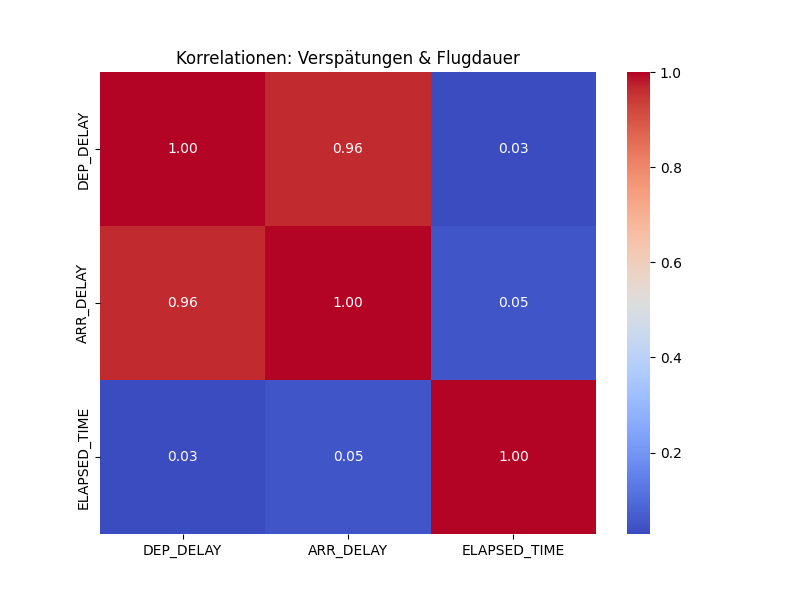
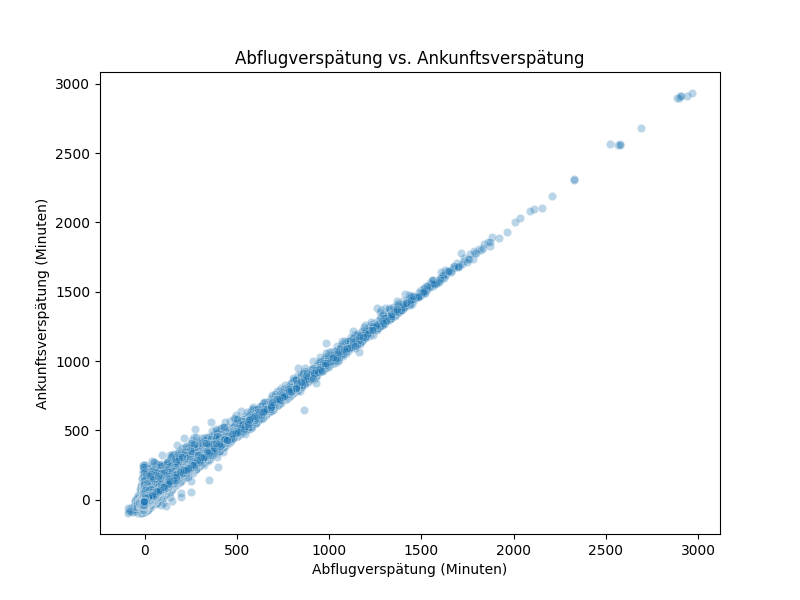
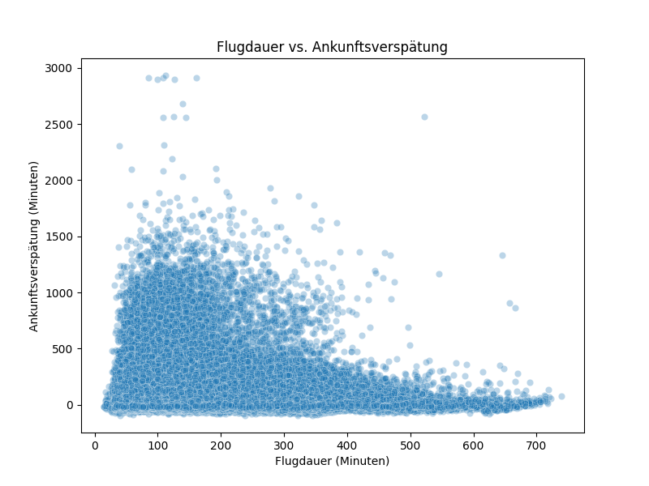

# ✈️ Flight Delay Prediction – Vorhersage von Flugverspätungen (2009-2023)

Dieses Projekt untersucht die **Verspätungen von Flügen** im Zeitraum **2009-2023**  
und entwickelt am Ende ein **Machine-Learning-Modell zur Vorhersage von Verspätungen**.

---

## 🚀 Ziel des Projekts
- **Analyse: Welche Airlines & Flughäfen sind besonders betroffen?**
- **Korrelationen: Welche Faktoren hängen mit Verspätungen zusammen?**
- **Machine Learning: Kann ein Modell vorhersagen, ob ein Flug verspätet sein wird (> 15 Minuten)?**

---

## 📂 Projektstruktur
- `data/` – Rohdaten (Flugverspätungen 2009-2023, 3 Mio. Stichprobe)
- `notebooks/` – Explorative Datenanalyse & Modelltraining (`flight_delay_analysis.ipynb`)
- `visuals/` – Diagramme & Plots
- `scripts/` – Python-Skripte (aktuell nicht genutzt)

---

## 🧪 Datenaufbereitung & Analyse

### 🔸 Bereinigung
- **Nur tatsächlich geflogene Flüge (keine Cancellations)**.
- **NaN-Werte bei Verspätungen entfernt**.

### 🔸 Korrelationen
| Variablenpaar                    | Korrelation |
|-----------------------------------|-------------|
| **Abflugverspätung ↔ Ankunftsverspätung** | **0.96 (Sehr stark)** |
| **Flugdauer ↔ Verspätung**        | **0.03 (Kein Zusammenhang)** |

📊 **Visualisierung:**  


---

## 📊 Scatterplots

### 🔸 Abflugverspätung vs. Ankunftsverspätung


### 🔸 Flugdauer vs. Ankunftsverspätung


---

## 🧠 Machine Learning: Vorhersage von Verspätungen

### 🔸 Zielvariable
- **`IS_DELAYED = 1` → Ankunftsverspätung > 15 Minuten**.
- **`IS_DELAYED = 0` → Pünktlich (oder kleine Verspätung)**.

### 🔸 Features
- **Abflugverspätung (`DEP_DELAY`)**.
- **Flugdauer (`ELAPSED_TIME`)**.
- **Airline, Startflughafen, Zielflughafen (Dummy-Variablen)**.

### 🟢 **Finales Modell: RandomForest (Balanced)**
- **`class_weight='balanced'`** → **Ausgleich der unbalancierten Klassen (82 % pünktlich, 18 % verspätet)**.
- **`max_depth=10`, `n_estimators=50` → Optimiert auf Rechenzeit & Performance**.

### 📈 **Modellergebnisse:**
| Metrik                          | Wert  |
|-----------------------------------|-------|
| **Accuracy (Gesamtgenauigkeit)** | **92 %** |
| **Recall (Verspätete Flüge erkennen)** | **81 %** |
| **Precision (Verspätungsvorhersagen korrekt)** | **76 %** |

---

## 📦 Installation & Nutzung
Falls du die Analyse lokal nachvollziehen willst:

```bash
pip install pandas matplotlib seaborn scikit-learn jupyter
jupyter notebook notebooks/flight_delay_analysis.ipynb
